# SECCIÓN 2: FUNCIONAMIENTO DE LOS MÓDULOS

---

## 2.1. SITIO WEB Y COMERCIO ELECTRÓNICO

### Descripción General
Los módulos **Sitio web** y **Comercio electrónico** de Odoo 18 Community permiten a QuetzalMart vender sus productos en línea desde `https://quetzalmart.store`. La tienda está integrada de forma nativa con el ERP: cada compra realizada por un cliente genera automáticamente la orden de venta, la factura, el movimiento de inventario y el registro del cliente en Contactos (CRM), sin necesidad de capturar la información dos veces.

Las funcionalidades implementadas son:

* **Catálogo de productos:** presentación de cada producto con imagen, descripción, precio y categoría.
* **Carrito de compras:** permite agregar y eliminar productos, y calcula el IVA y el costo de envío.
* **Proceso de pago:** registro de datos del cliente, selección del método de envío y pago con un proveedor en modo de prueba.
* **Facturación automática:** al confirmarse el pago se genera la factura y se envía por correo al cliente.
* **Cuentas de cliente:** los clientes pueden registrarse libremente o comprar como invitados.

---

### PASO 1: Página de Inicio del Sitio Web
El sitio se personalizó desde el editor visual de Odoo (botón **Editar**) con la identidad de QuetzalMart: logotipo en el encabezado, portada con el botón *Comprar ahora* que dirige a la tienda, bloque dinámico de productos y pie de página con la información de contacto y la descripción de la empresa.

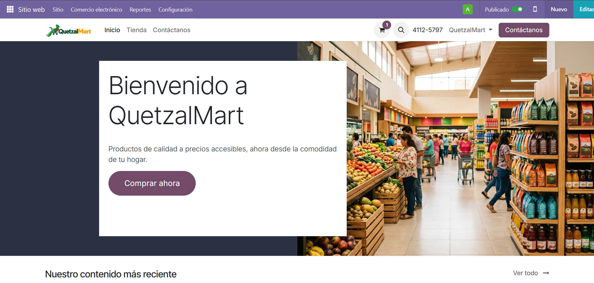
> **Captura 2.1.1:** *Página de inicio de `quetzalmart.store` con el logotipo de QuetzalMart, la portada con acceso directo a la tienda y el bloque de productos destacados.*

---

### PASO 2: Catálogo de Productos y Categorías
Los productos se publican en la tienda desde **Sitio web → Comercio electrónico → Productos**. En la pestaña **Ventas** de cada producto, sección *Tienda de comercio electrónico*, se marca **Está publicado** y se asigna la categoría del sitio web. Las categorías creadas son:

| Categoría | Productos |
|---|---|
| Bebidas | Café Quetzal Molido 454 g, Horchata en Polvo 400 g, Agua Pura, Gaseosa Cola 3 L |
| Abarrotes | Frijol Negro Volteado 400 g, Arroz Blanco Premium 2 lb, Tortillas de Maíz (paquete 30) |
| Lácteos | Queso Fresco 1 lb, Leche Entera 1 L |
| Limpieza e higiene | Detergente en Polvo 1 kg, Jabón de Tocador (3 unidades) |

Cada producto cuenta con imagen, precio de venta con IVA incluido y una descripción corta escrita desde el editor de la página del producto. El filtro de categorías se habilitó en la tienda (`/shop`) desde las opciones del editor.

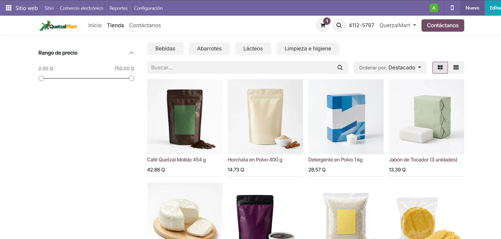
> **Captura 2.1.2:** *Vista de la tienda (`/shop`) con el catálogo de productos y el filtro por categorías.*

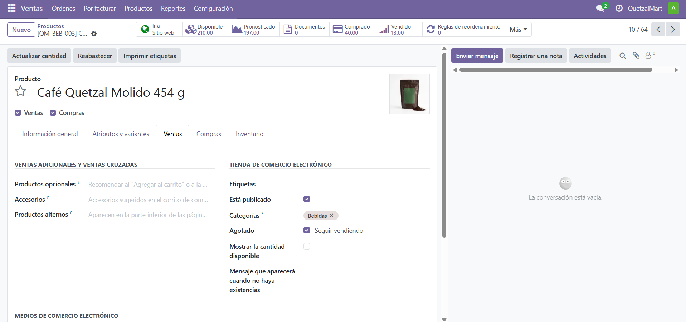
> **Captura 2.1.3:** *Pestaña Ventas del producto en Odoo, mostrando las opciones **Está publicado** y **Categorías** de la sección Tienda de comercio electrónico.*

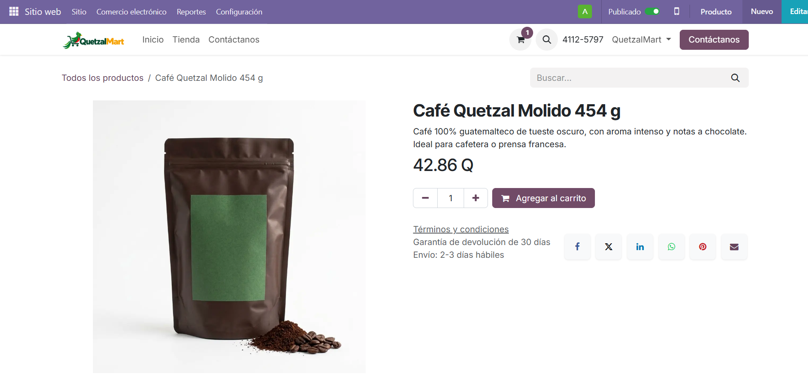
> **Captura 2.1.4:** *Página de detalle de un producto con su imagen, precio, descripción y el botón para agregarlo al carrito.*

---

### PASO 3: Impuestos y Precios
La compañía QuetzalMart está configurada con país **Guatemala** y moneda **Quetzal (GTQ)**. Todos los productos tienen asignado el impuesto de venta **IVA 12 %**, incluido en el precio. Por ejemplo, el *Café Quetzal Molido 454 g* tiene un precio de Q 48.00, que corresponde a Q 42.86 más Q 5.14 de IVA. De esta forma el precio que ve el cliente en la tienda es el precio final.

---

### PASO 4: Método de Envío
Desde **Sitio web → Configuración → Métodos de envío** se creó el método **Envío estándar** con proveedor *Precio fijo* y costo de **Q 25.00**. El carrito agrega automáticamente este cargo al total del pedido cuando el cliente lo selecciona durante el pago.

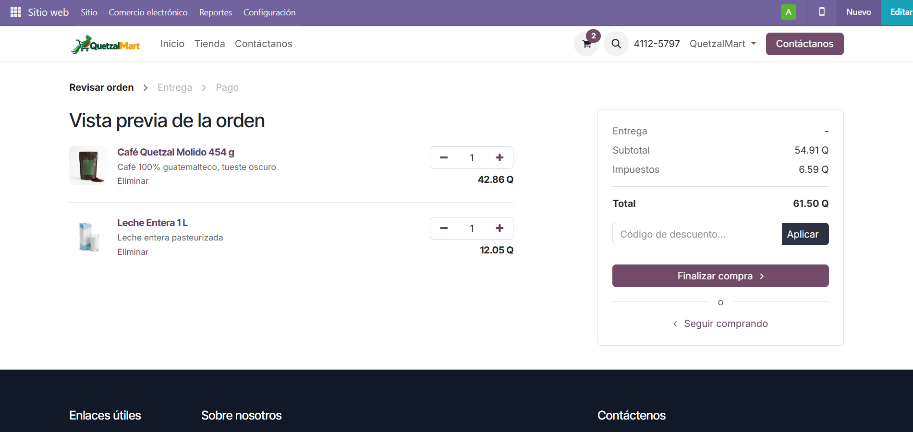
> **Captura 2.1.5:** *Resumen del carrito durante el pago, mostrando el subtotal, el IVA 12 %, el costo del Envío estándar y el total del pedido.*

---

### PASO 5: Proveedor de Pago en Modo de Prueba
En **Sitio web → Configuración → Proveedores de pago** se activó el proveedor **Demo** en estado *Modo de prueba*. Este proveedor simula transacciones aprobadas sin cobrar dinero real, lo que permite probar el flujo completo de compra. Se desactivó la opción de *pago rápido* para que el cliente siempre complete el formulario con sus datos y el proceso de pago pase por todos sus pasos.

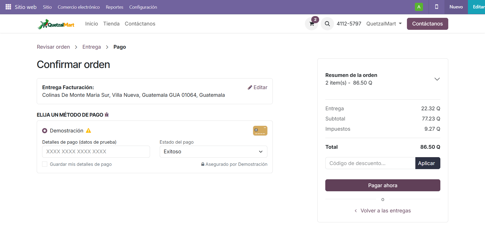
> **Captura 2.1.6:** *Paso de pago de la tienda con la selección del método de envío y el proveedor de pago Demo.*

---

### PASO 6: Cuentas de Cliente y Facturación Automática
* **Registro libre:** en **Ajustes → Acceso del cliente** se seleccionó *Registro libre*, de modo que cualquier visitante puede crear su cuenta desde el botón *Iniciar sesión → Registrarse*. Al registrarse, el cliente recibe un correo de bienvenida.
* **Política de facturación:** en los ajustes de Ventas se configuró *Facturar lo ordenado*, lo que permite generar la factura en el momento de la venta.
* **Factura automática:** al confirmarse el pago en línea, Odoo genera y publica la factura, la marca como pagada y la envía por correo al cliente.

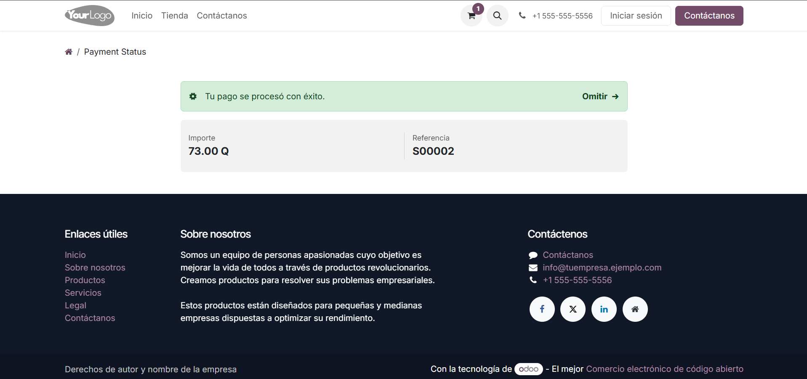
> **Captura 2.1.7:** *Página de confirmación que el cliente ve al completar su compra.*

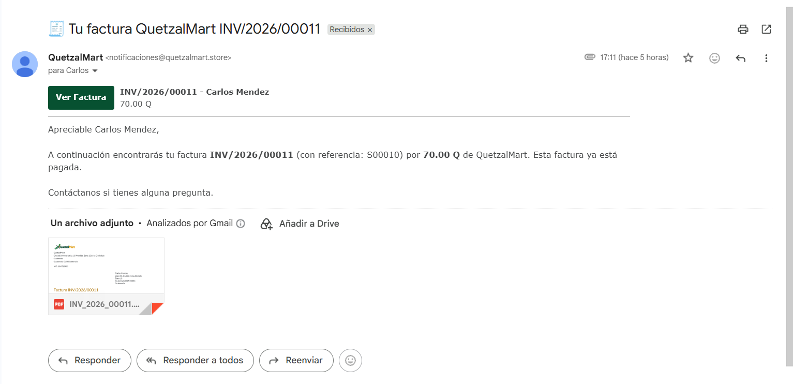
> **Captura 2.1.8:** *Correo recibido por el cliente con la confirmación del pedido y la factura en PDF.*

---

### PASO 7: Integración con el ERP
Cada compra en la tienda queda registrada automáticamente en los demás módulos de Odoo:

* **Ventas:** se crea la orden de venta con el cliente, los productos, el envío y el pago.
* **Facturación:** se genera la factura vinculada a la orden.
* **Inventario:** se crea la entrega y se descuenta la cantidad a la mano de los productos vendidos.
* **Contactos (CRM):** el cliente queda registrado con su historial de compras.

Los carritos que no llegan a pagarse se conservan como cotizaciones y pueden consultarse en **Sitio web → Comercio electrónico → Carritos abandonados**.

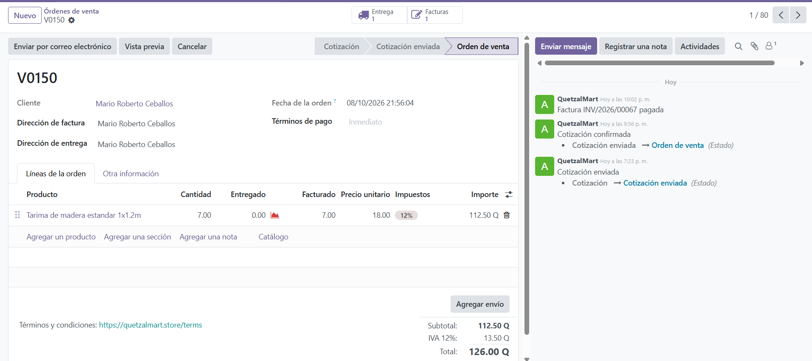
> **Captura 2.1.9:** *Orden de venta creada automáticamente por una compra en línea, con los botones inteligentes de Entrega y Facturas.*

---

## 2.2. GOOGLE ANALYTICS 4 (GA4)

### Descripción General
La tienda en línea está integrada con **Google Analytics 4** bajo el modelo de comercio electrónico mejorado. GA4 registra el recorrido de cada visitante (qué productos ve, qué agrega al carrito, cuándo inicia el pago y cuándo compra) junto con la fuente de la que llegó y el dispositivo que utiliza. Con esta información se mide la efectividad de las campañas, la tasa de conversión, los productos más vendidos y los puntos de abandono del embudo de compra. El análisis de estos datos se presenta en el **Manual 3**.

---

### PASO 1: Creación de la Propiedad en GA4
En `analytics.google.com` se creó la cuenta **QuetzalMart** con la propiedad **QuetzalMart Tienda en línea** y la siguiente configuración:

* **Zona horaria:** Guatemala.
* **Moneda:** Quetzal guatemalteco (GTQ), igual a la moneda de Odoo.
* **Flujo de datos:** Web, URL `quetzalmart.store`, con la medición mejorada activada.
* **Retención de datos:** 14 meses, para que las exploraciones puedan usar todo el historial.

Al crear el flujo de datos, GA4 genera el **ID de medición** (formato `G-XXXXXXXXXX`) que identifica a la tienda.

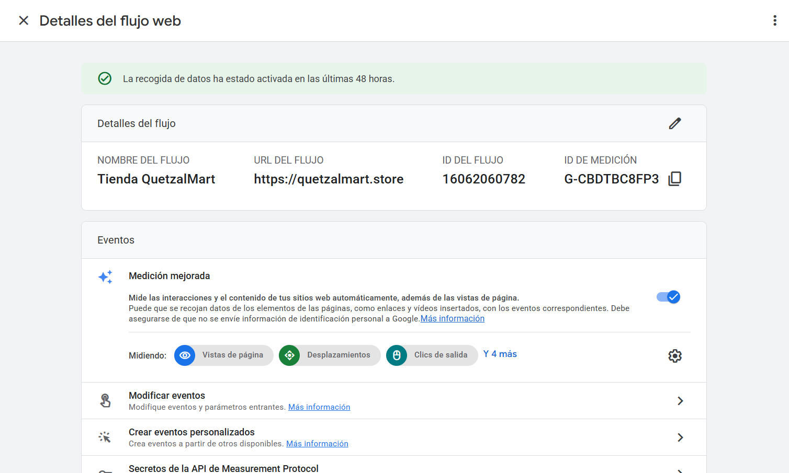
> **Captura 2.2.1:** *Detalle del flujo de datos web de la propiedad QuetzalMart con su ID de medición.*

---

### PASO 2: Conexión de GA4 con Odoo
En **Sitio web → Configuración → Ajustes** se activó la opción **Google Analytics** y se ingresó el ID de medición. A partir de ese momento, Odoo inserta la etiqueta de GA4 en todas las páginas del sitio y envía automáticamente los eventos de comercio electrónico. La conexión se verificó en **Informes → Tiempo real**, donde aparecieron los usuarios activos al navegar la tienda.

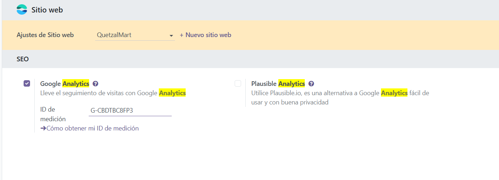
> **Captura 2.2.2:** *Ajustes del sitio web en Odoo con la opción Google Analytics activada y el ID de medición.*

---

### PASO 3: Eventos de Comercio Electrónico
La tienda envía a GA4 los cuatro eventos requeridos del proceso de compra:

| Evento | Momento en que se envía | Origen |
|---|---|---|
| `view_item` | El cliente abre la ficha de un producto | Odoo (automático) |
| `add_to_cart` | El cliente agrega un producto al carrito | Odoo (automático) |
| `begin_checkout` | El cliente inicia el proceso de pago | Código personalizado |
| `purchase` | Se muestra la confirmación del pedido, con valor, moneda y productos | Odoo (automático) |

En las pruebas se comprobó que Odoo no enviaba el evento `begin_checkout`, por lo que se agregó un fragmento de código en el sitio desde el editor (**Editar → Tema → Avanzado → Inyección de código**, al final del `<body>`). El código detecta cuando el cliente entra a las páginas de pago (`/shop/checkout` o `/shop/address`), envía el evento una sola vez por compra y se reinicia al llegar a la confirmación del pedido:

```html
<script>
(function () {
  var p = window.location.pathname;

  // Al confirmar la compra, se reinicia para la siguiente
  if (p.indexOf('/shop/confirmation') === 0) {
    try { sessionStorage.removeItem('qm_begin_checkout'); } catch (e) {}
    return;
  }

  // Al entrar al proceso de pago
  if (p.indexOf('/shop/checkout') === 0 || p.indexOf('/shop/address') === 0) {
    try {
      if (sessionStorage.getItem('qm_begin_checkout')) return;
      sessionStorage.setItem('qm_begin_checkout', '1');
    } catch (e) {}

    var intentos = 0;
    (function enviar() {
      if (typeof window.gtag === 'function') {
        window.gtag('event', 'begin_checkout', { currency: 'GTQ' });
      } else if (intentos++ < 20) {
        setTimeout(enviar, 500);
      }
    })();
  }
})();
</script>
```

Los cuatro eventos se verificaron con la extensión *Google Analytics Debugger* en **Administrar → DebugView**, realizando una compra completa en la tienda.


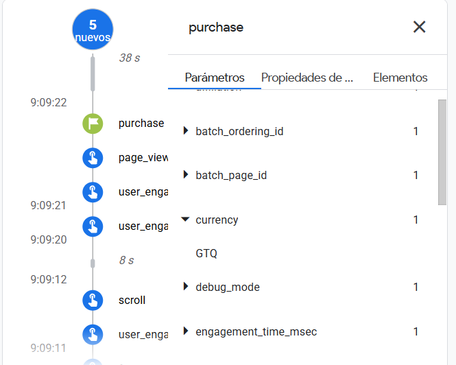
> **Captura 2.2.4:** *DebugView de GA4 mostrando la secuencia `view_item`, `add_to_cart`, `begin_checkout` y `purchase` de una compra de prueba.*

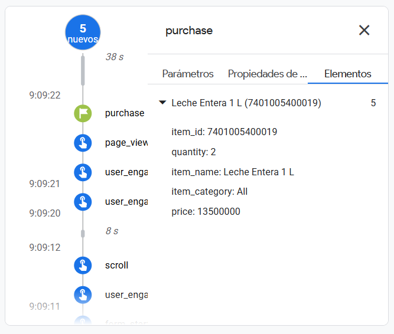
> **Captura 2.2.5:** *Detalle del evento `purchase` en DebugView con los parámetros `value`, `currency` e `items`.*

---

### PASO 4: Evento Clave de Conversión
En **Administrar → Eventos clave** se marcó `purchase` como **evento clave**. Esto permite a GA4 calcular la tasa de conversión, es decir, el porcentaje de usuarios que completan una compra.

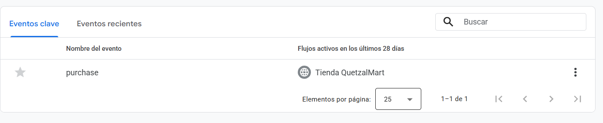
> **Captura 2.2.6:** *Lista de eventos clave de la propiedad con `purchase` activado.*

---

### PASO 5: Audiencias
En **Administrar → Audiencias** se crearon tres audiencias, con duración de pertenencia ajustada al límite máximo:

| Audiencia | Condición | Uso para el negocio |
|---|---|---|
| **Compradores** | Usuarios con el evento `purchase` | Campañas de fidelización y promociones para clientes recurrentes |
| **Carrito abandonado** (personalizada) | Incluye usuarios con `add_to_cart` y excluye de forma permanente a los que tienen `purchase` | Envío de recordatorios o cupones para recuperar ventas |
| **Visitantes móviles** | Categoría de dispositivo = `mobile` | Campañas y mejoras de experiencia dirigidas a celulares |

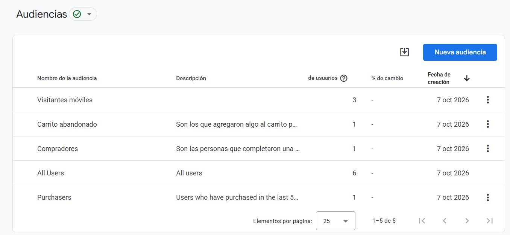
> **Captura 2.2.7:** *Lista de audiencias de la propiedad QuetzalMart.*

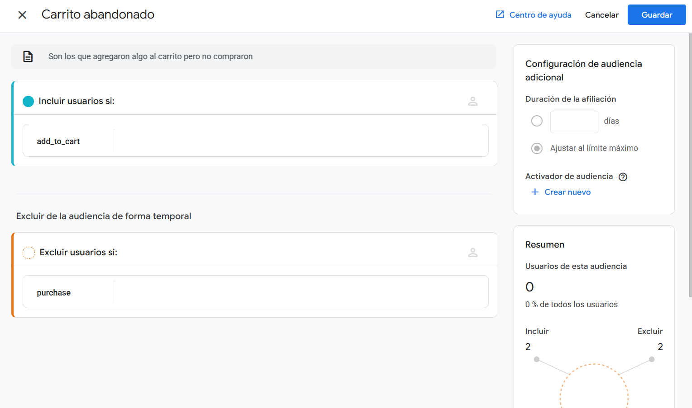
> **Captura 2.2.8:** *Editor de la audiencia personalizada Carrito abandonado, con el grupo de inclusión `add_to_cart` y el grupo de exclusión permanente `purchase`.*

---

### PASO 6: Exploraciones
En la sección **Explorar** se crearon dos exploraciones:

1. **Embudo de compra QuetzalMart** (exploración de embudo): mide cuántos usuarios avanzan por los pasos *Ver producto* (`view_item`) → *Agregar al carrito* (`add_to_cart`) → *Iniciar pago* (`begin_checkout`) → *Compra* (`purchase`), con la tasa de finalización y de abandono de cada paso, desglosado por categoría de dispositivo. Los pasos están configurados como *le sigue indirectamente* para respetar la navegación natural del cliente.
2. **Análisis de ventas y tráfico QuetzalMart** (forma libre), con dos pestañas:
   * **Fuentes y dispositivos:** filas por fuente de la sesión y columnas por categoría de dispositivo, con usuarios activos, eventos clave y total de ingresos.
   * **Productos más vendidos:** filas por nombre del artículo, con artículos comprados e ingresos del artículo.

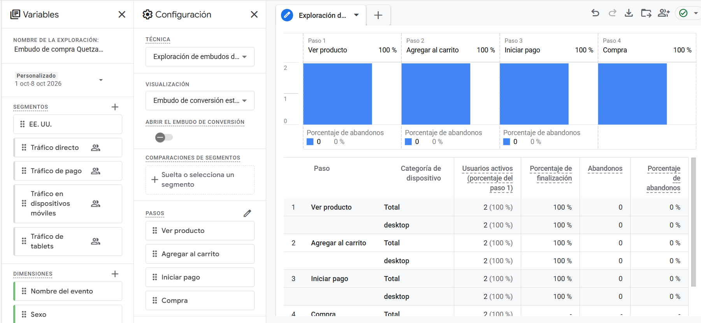
> **Captura 2.2.9:** *Configuración de los cuatro pasos del embudo de compra y su resultado.*

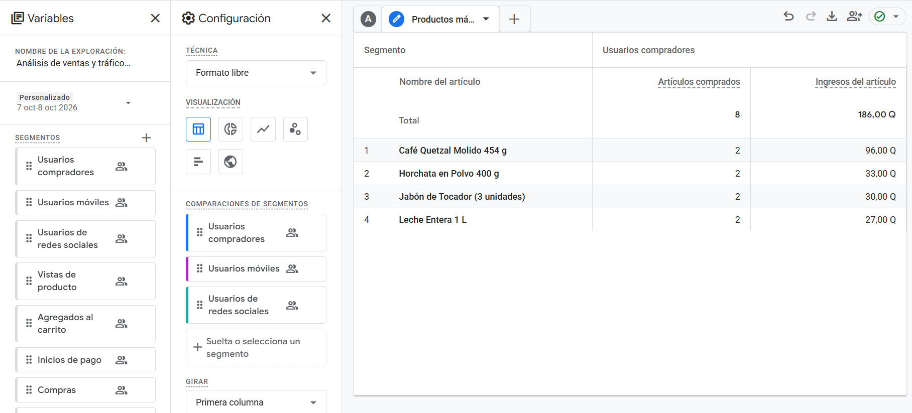
> **Captura 2.2.10:** *Exploración de forma libre con las pestañas de fuentes y dispositivos y de productos más vendidos.*

---

### PASO 7: Segmentos
Dentro de las exploraciones se crearon ocho segmentos, guardados en la propiedad para reutilizarlos en ambas:

| Tipo | Segmento | Condición |
|---|---|---|
| Usuarios | Usuarios compradores | Evento `purchase` |
| Usuarios | Usuarios móviles | Categoría de dispositivo = `mobile` |
| Usuarios | Usuarios de redes sociales | Medio de la sesión contiene `social` (Facebook e Instagram) |
| Eventos | Vistas de producto | Evento `view_item` |
| Eventos | Agregados al carrito | Evento `add_to_cart` |
| Eventos | Inicios de pago | Evento `begin_checkout` |
| Eventos | Compras | Evento `purchase` |
| Eventos | Compras mayores a Q 100 | Evento `purchase` con parámetro `value` > 100 |

Para generar tráfico de distintas fuentes se utilizaron enlaces con parámetros UTM, por ejemplo:
`https://quetzalmart.store/shop?utm_source=facebook&utm_medium=social&utm_campaign=lanzamiento`

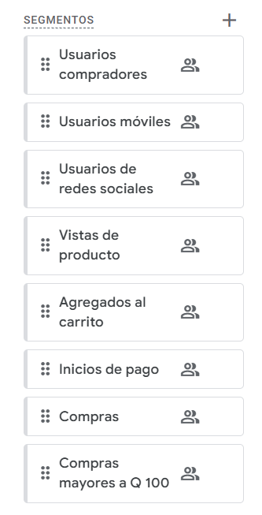
> **Captura 2.2.11:** *Lista de segmentos de usuarios y de eventos disponibles en la exploración.*

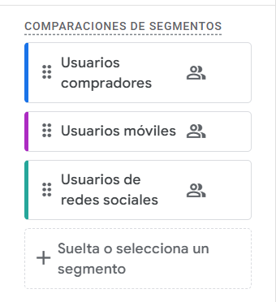
> **Captura 2.2.12:** *Exploración de forma libre con segmentos aplicados en Comparaciones de segmentos.*

---

# SECCIÓN 4: AUTOMATIZACIÓN DE PROCESOS ROBÓTICOS (RPA) CON UIPATH

---

## 4.1. PASO A PASO DE LA IMPLEMENTACIÓN DEL ROBOT (SOLUCIÓN A PROBLEMAS)

A continuación se detalla cada una de las fases desarrolladas dentro del flujo de trabajo de UiPath para dar solución a los problemas planteados (dispersión de carpetas, hojas heterogéneas, inconsistencias de datos y carga masiva web), acompañadas de las capturas correspondientes.

### PASO 1: Parametrización en Archivo Externo (`Config.xlsx`)
Para evitar valores codificados de forma rígida (*hardcoded*) y permitir una ejecución flexible tanto en entornos de pruebas locales como en los servidores de producción en la nube, se creó el libro `Config.xlsx`.

* **Parámetros configurados en Config.xlsx:**
  * `RutaEntrada`: `C:\QuetzalMart_RPA\Entrada` (árbol de carpetas y archivos desordenados).
  * `RutaSalida`: `C:\QuetzalMart_RPA\Salida` (directorio para los 5 archivos consolidados y el log de auditoría).
  * `OdooUrl`: `https://quetzalmart.store` (URL pública del ERP Odoo).
  * `OdooDb`: `quetzalmart` (Base de datos empresarial en PostgreSQL).
  * `OdooUser`: `<CORREO_ADMINISTRADOR>` (Usuario con privilegios de importación).
  * `OdooPassword`: `<PASSWORD_ADMINISTRADOR>` (Contraseña parametrizada en Config.xlsx).
  * `VersionOdoo`: `18` (Versión de Odoo Community).
  * `UbicacionInventario`: `WH/Stock` (Ubicación predeterminada de almacenamiento).
  * `EjecutarImportacionWeb`: `False` (Modo consolidación rápida para generar y auditar los 5 libros Excel; alternable a `True` para ejecutar la importación automática en navegador).

* **Parámetros de Comprobación en Base de Datos (SQL):**
  * Servidor / Host: Servidor de base de datos del proyecto (`quetzalmart`)
  * Motor: PostgreSQL
  * Base de datos: `quetzalmart`
  * Usuario: Cuenta de solo lectura / consulta

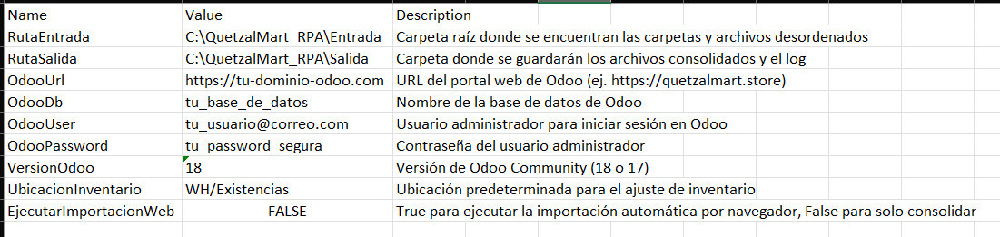
> **Captura 4.1:** *Vista del archivo `Config.xlsx` en Excel mostrando la hoja `Settings` con las variables de configuración parametrizadas externamente sin quemar credenciales en el código fuente.*

---

### PASO 2: Inicialización de Esquemas de Datos (`InicializarTablas.xaml`)
En este workflow se inicializan en memoria las estructuras tabulares (`DataTable`) que albergarán la información consolidada durante el ciclo de vida del robot:

1. `dtCliEmp`: Clientes que son empresas o no tienen compañía padre asignada.
2. `dtCliPer`: Clientes que corresponden a personas/contactos vinculados a una empresa (`parent_id`). Se separan en dos archivos para garantizar la integridad referencial en Odoo (primero deben existir las empresas matrices antes de crear los contactos asociados).
3. `dtPro`: Catálogo consolidado de productos con sus atributos comerciales y técnicos.
4. `dtInv`: Registro de ajustes físicos de inventario para alimentar la *Cantidad a la mano*.
5. `dtLog`: Estructura de auditoría donde se registran los rechazos y advertencias fila por fila.

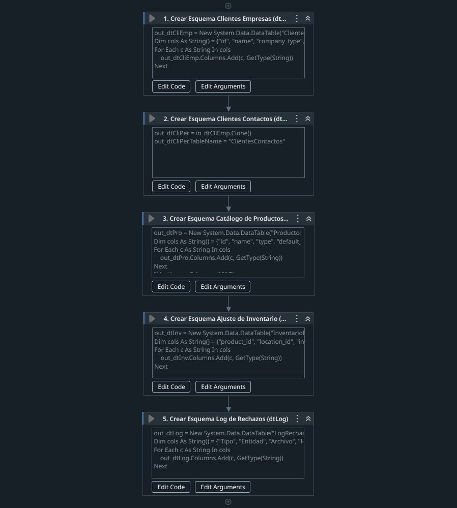
> **Captura 4.2:** *Diagrama del workflow `InicializarTablas.xaml` en UiPath Studio mostrando la secuencia modular que construye los esquemas de datos para clientes, productos, inventario y log.*

---

### PASO 3: Recorrido Recursivo e Identificación de Hojas (`ProcesarArchivos.xaml`)
Para cumplir el requerimiento de inspeccionar todas las carpetas sin importar la profundidad de los subdirectorios, el robot ejecuta:
1. `Directory.GetFiles(in_RutaEntrada, "*.*", SearchOption.AllDirectories)`: Recupera la totalidad de los archivos contenidos en el árbol.
2. Filtro de extensiones: Se verifica que el archivo finalice en `.xlsx`, `.xls` o `.xlsm` y que no sea un archivo temporal bloqueado (`~$...`).
3. Lectura de estructura con `Excel Application Scope` y `Get Workbook Sheets`: Se obtiene la lista dinámica de todas las hojas existentes en el libro.
4. Evaluación insensible a mayúsculas/minúsculas y espacios:
   * Si la hoja se llama `"clientes"`, se extrae con `Read Range` y se transfiere al módulo de validación de clientes.
   * Si la hoja se llama `"productos"`, se extrae con `Read Range` y se transfiere al módulo de validación de productos.
   * Cualquier otra hoja (`proveedor`, `reclamos`, `registros`, etc.) es omitida de forma automática.

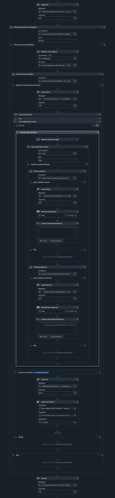
> **Captura 4.3:** *Workflow `ProcesarArchivos.xaml` en UiPath Studio mostrando el bucle `For Each` de archivos, el `Excel Application Scope` y las condiciones `If` evaluando los nombres de hoja.*

---

### PASO 4: Reglas de Negocio y Validación Rigurosa (`Invoke Code`)
Para asegurar un rendimiento óptimo al procesar miles de filas y mantener reglas de validación complejas sin sobrecargar el lienzo con decenas de actividades individuales, se implementaron rutinas en VB.NET encapsuladas en actividades `Invoke Code`.

#### A. Validación de Clientes (`ValidarClientes.vb`)
* **Mapeo Inteligente de Columnas:** Tolera encabezados con o sin asterisco, en inglés o español (`Name*`, `Nombre`, `Company Type*`, `Tipo de compañía`, etc.).
* **Campos Obligatorios:** `Name` y `Company Type` deben contener datos. Si faltan, la fila se rechaza inmediatamente.
* **Normalización de Tipos:** Se homologa `Company` o `Person` independientemente de si venía como *Empresa*, *Persona*, *Individual*.
* **Validación de Correo:** Expresión regular para garantizar que el email cumpla la estructura estándar `usuario@dominio.ext`.
* **Detección de Duplicados:** Se compara la tupla `(Nombre, Email)` contra los registros ya admitidos en memoria.
* **External ID Seguro:** Se genera un identificador único basado en la referencia o el nombre (`qm_cli_...`) para permitir idempotencia en Odoo.

#### B. Validación de Productos e Inventario (`ValidarProductos.vb`)
* **Campos Obligatorios:** `External ID` (id), `Name` y `Product Type`.
* **Tipos de Producto Odoo:** Se homologa a `Goods` (bienes almacenables) o `Service` (servicios). En Odoo 18 se incluye automáticamente la bandera técnica `is_storable = True`.
* **Validación Numérica:** `Sales Price`, `Cost`, `Weight` y `Cantidad a la mano` deben ser valores numéricos válidos mayores o iguales a cero. Si son negativos o contienen texto, la fila se rechaza.
* **Gestión del Estado Publicado:**
  * Si la columna `Está publicado` indica *True*, *Verdadero*, *Sí*, *1* o *Publicado*, se marca con `is_published = True`.
  * Si indica *False*, *No*, *0* o vacío, se marca con `is_published = False`.
  * Valores ambiguos generan rechazo de fila.
* **Regla de Negocio para Servicios:** Si un producto es de tipo `Service`, no puede almacenar unidades en bodega. Si el archivo contenía una cantidad a la mano, el robot registra una advertencia en el log y no crea línea de ajuste de inventario.
* **Separación de Inventario:** Para cada bien físico con existencias mayores a cero, se crea una línea vinculada a la ubicación de almacén (`WH/Stock`) lista para impactar la tabla de quants.

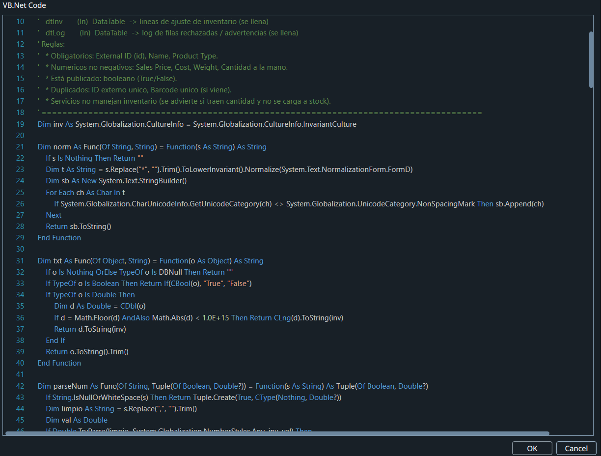
> **Captura 4.4:** *Propiedades y editor de código de la actividad `Invoke Code` en UiPath Studio con el código VB.NET y los argumentos `dtHoja`, `dtPro`, `dtInv` y `dtLog`.*

---

### PASO 5: Generación de Entregables Consolidados (`GuardarConsolidados.xaml`)
Una vez concluido el barrido de todas las carpetas, el robot invoca la actividad `Write Range` para plasmar los datos en la carpeta de salida:
1. `01_clientes_empresas.xlsx`: Empresas y clientes individuales independientes.
2. `02_clientes_contactos.xlsx`: Contactos vinculados a sus empresas matrices mediante la columna `parent_id`.
3. `03_productos.xlsx`: Catálogo maestro con precios, costos, pesos, referencias y visibilidad web (`is_published`).
4. `04_inventario_cantidad_a_la_mano.xlsx`: Archivo para el ajuste de inventario con `product_id`, `location_id` y `inventory_quantity`.
5. `log_filas_rechazadas.xlsx`: Registro de auditoría con las columnas `Tipo` (RECHAZADO/ADVERTENCIA), `Entidad`, `Archivo`, `Hoja`, `Fila`, `Identificador` y `Motivo`.

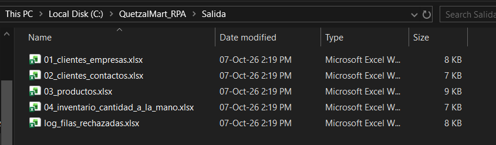
> **Captura 4.5:** *Explorador de Windows mostrando los cinco archivos Excel generados en la carpeta `C:\QuetzalMart_RPA\Salida`.*

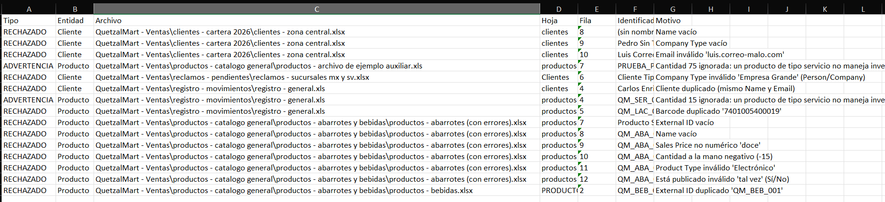
> **Captura 4.6:** *Vista previa del archivo `log_filas_rechazadas.xlsx` mostrando el detalle exacto de las filas descartadas por Name vacío, correos inválidos, precios erróneos y duplicados.*

---

### PASO 6: Automatización de la Carga Web en Odoo (`ImportarOdooWeb.xaml`)
De acuerdo con las directrices del proyecto, la carga se realiza exclusivamente a través de la interfaz web de Odoo Community, emulando la interacción del navegador web (Microsoft Edge o Google Chrome, ambos basados en el motor Chromium) sin utilizar la API XML-RPC:

1. **Autenticación:** El robot abre el navegador (Microsoft Edge por defecto en Windows), navega a `/web/login`, ingresa el usuario y contraseña del administrador y presiona el botón de envío.
2. **Importación de Clientes Empresas:**
   * Navega a la vista de lista de contactos (`/odoo/contacts?view_type=list`).
   * Despliega el menú de acciones (icono de engranaje) y hace clic en `Import records`.
   * Pulsa `Upload Data File`, interactúa con el cuadro de diálogo del sistema operativo seleccionando `01_clientes_empresas.xlsx` y ejecuta `Import`.
3. **Importación de Contactos Relacionados:**
   * Repite el proceso con `02_clientes_contactos.xlsx`, resolviendo los vínculos hacia las empresas recién creadas.
4. **Importación del Catálogo de Productos:**
   * Navega a la lista de productos (`/odoo/inventory/products?view_type=list`).
   * Abre el asistente de importación, carga `03_productos.xlsx` y valida la importación masiva. Los productos quedan registrados con su precio de venta, costo y estado de publicación en la tienda online.
5. **Ajuste de Cantidad a la Mano (Inventario):**
   * Navega a la sección de inventario físico (`/odoo/action-419` o `/odoo/physical-inventory`).
   * Carga el archivo `04_inventario_cantidad_a_la_mano.xlsx`.
   * Presiona el botón `Apply All` (*Aplicar todo*) para actualizar el stock real en la ubicación interna `WH/Existencias`.

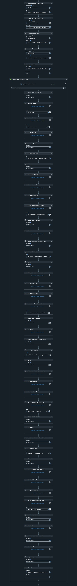
> **Captura 4.7:** *Secuencia de UI Automation en UiPath Studio mostrando las actividades `Open Browser`, `Type Into`, `Click` y selectores para la navegación web en Odoo.*

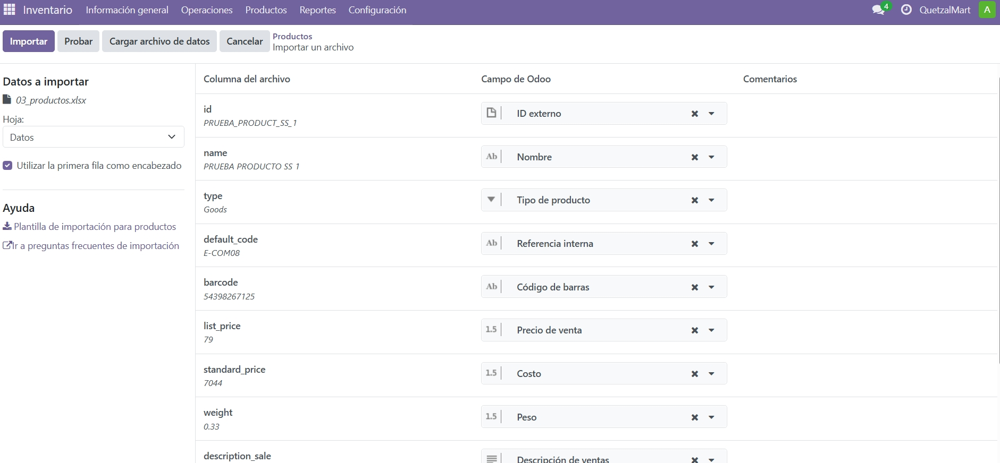
> **Captura 4.8:** *Asistente de importación de Odoo Community en pantalla completa mostrando el archivo de productos cargado y el mapeo automático de campos.*

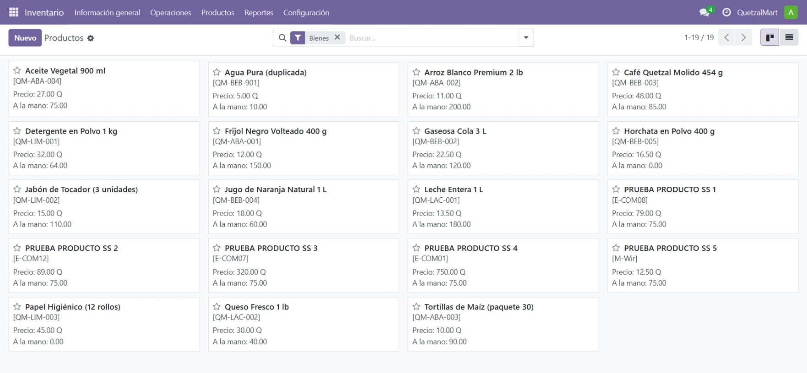
> **Captura 4.9:** *Vista del catálogo de productos en Odoo tras la ejecución del RPA, demostrando los productos publicados y las cantidades a la mano actualizadas.*

---

## 4.2. VENTAJAS DE IMPLEMENTAR RPA EN QUETZALMART

La adopción de Robotic Process Automation en la cadena de tiendas QuetzalMart genera un impacto sustancial en múltiples dimensiones operativas, financieras y estratégicas:

### 1. Eliminación Radical del Tiempo de Operación Manual
* **Antes del RPA:** La revisión manual de decenas de carpetas y libros dispersos, la extracción de hojas y la digitación en Odoo tomaba un estimado de **20 a 30 horas hombre** por lote de sucursal.
* **Con el RPA:** El robot recorre el árbol completo, valida reglas complejas y prepara los consolidados en **menos de 30 segundos**, ejecutando la carga web en menos de 2 minutos. Esto representa una reducción de tiempo superior al **98%**.

### 2. Cero Tolerancia a Errores y Calidad de Datos Garantizada
* El factor humano al copiar y pegar datos suele introducir errores de digitación (comas por puntos en precios, correos mal escritos, omisión de campos requeridos).
* El robot aplica reglas determinísticas al 100%: no permite que ningún registro incompleto o corrupto ingrese a la base de datos empresarial de QuetzalMart.

### 3. Trazabilidad y Auditoría Total (Log de Rechazos)
* En un proceso manual, los datos erróneos se pierden o se ignoran sin registro.
* El robot genera un archivo formal (`log_filas_rechazadas.xlsx`) que identifica el archivo de origen, la hoja, el número de fila, el dato causante y el motivo exacto del rechazo. Esto permite al departamento de ventas corregir en el origen los datos problemáticos.

### 4. Respeto Estricto a la Arquitectura Sin Alterar APIs
* Al utilizar la interfaz gráfica web nativa de Odoo, el robot respeta todos los mecanismos de seguridad, permisos de usuario y reglas de negocio del framework web de Odoo sin requerir exponer puertos, programar controladores REST o habilitar servicios API externos que pudieran vulnerar la seguridad de la nube.

### 5. Escalabilidad Inmediata ante Nuevas Sucursales
* Ante la apertura planificada de nuevas tiendas en otros países de la región centroamericana, no se requiere contratar más personal operativo para procesar catálogos. La misma infraestructura de automatización puede procesar 10 o 1,000 archivos sin variaciones en el costo marginal.

### 6. Liberación de Talento Humano para Tareas Estratégicas
* Los colaboradores de ventas y TI dejan de actuar como "transcripteurs de datos" y pueden dedicar su tiempo a optimizar campañas de mercadeo, mejorar la atención al cliente y analizar las tendencias comerciales que impulsen la rentabilidad de QuetzalMart.


