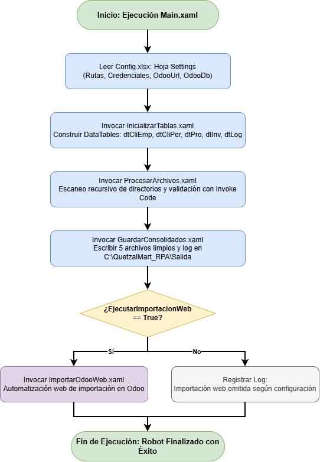
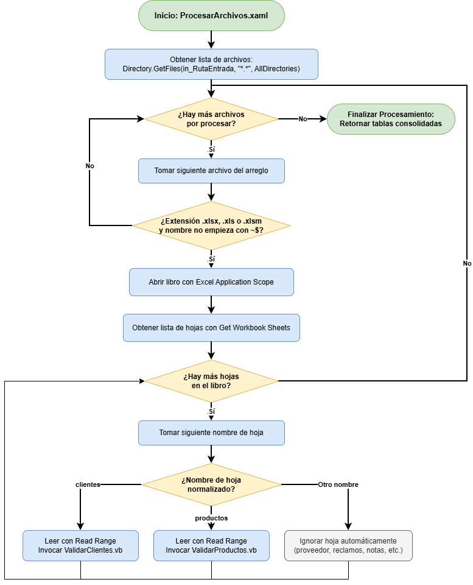
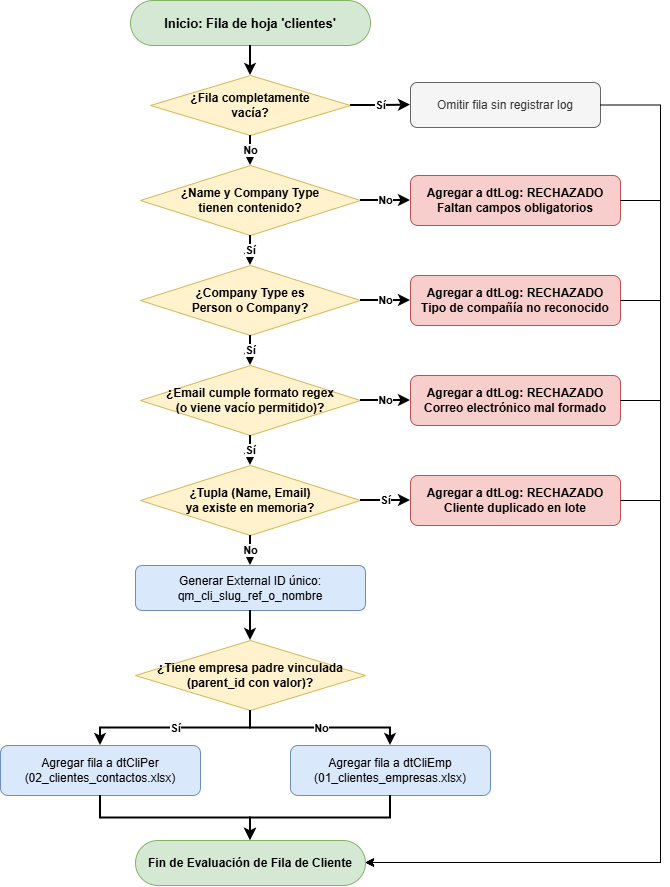
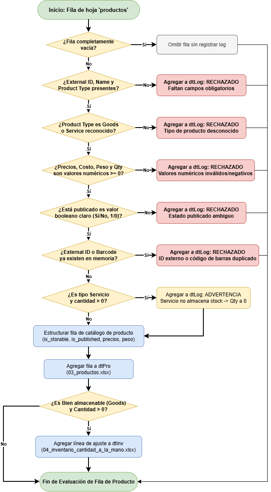
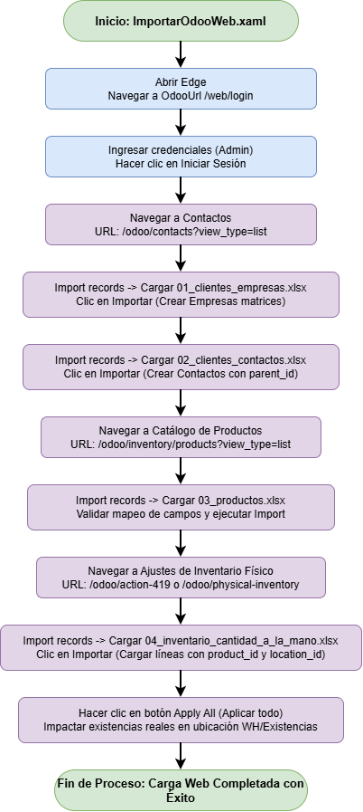
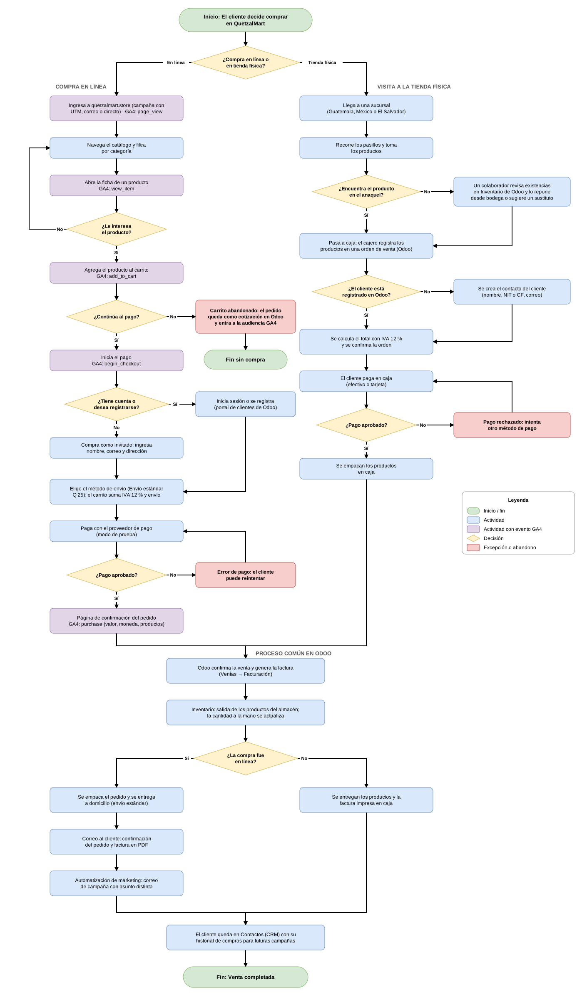

## 1. DIAGRAMA GENERAL DE CICLO DE VIDA (PIPELINE PRINCIPAL)

El siguiente diagrama modela el flujo orquestador principal (`Main.xaml`), el cual coordina secuencialmente la carga de parámetros externos, inicialización de estructuras en memoria, procesamiento de carpetas, generación de archivos consolidados y la interacción web con Odoo Community.

> **Diagrama 1:** *Diagrama de flujo del pipeline principal (`Main.xaml`), mostrando la orquestación secuencial desde la lectura de configuración externa hasta la finalización del robot.*

---

## 2. DIAGRAMA DE FLUJO: ESCANEO RECURSIVO Y SELECCIÓN DE HOJAS

Modela el algoritmo implementado en `ProcesarArchivos.xaml` para recorrer recursivamente cualquier nivel de subcarpetas en la ruta de entrada, filtrando exclusivamente libros de Excel e inspeccionando el nombre de sus hojas.

> **Diagrama 2:** *Diagrama de flujo de `ProcesarArchivos.xaml`, ilustrando el recorrido recursivo de archivos, el filtro de extensiones válidas y la discriminación de hojas `clientes` y `productos`.*

---

## 3. DIAGRAMA DE FLUJO: VALIDACIÓN Y CONSOLIDACIÓN DE CLIENTES

Modela la lógica implementada en `ValidarClientes.vb`, encargada de validar campos obligatorios, verificar formatos de correo, detectar registros duplicados y clasificar entre empresas matrices y contactos relacionados.

> **Diagrama 3:** *Diagrama de flujo de `ValidarClientes.vb`, detallando la cascada de validación de negocio, registro de rechazos en `dtLog` y separación entre `01_clientes_empresas.xlsx` y `02_clientes_contactos.xlsx`.*

---

## 4. DIAGRAMA DE FLUJO: VALIDACIÓN DE PRODUCTOS, VISIBILIDAD E INVENTARIO

Modela la lógica implementada en `ValidarProductos.vb` para comprobar campos mandatorios, validar precios y cantidades no negativas, clasificar entre bienes y servicios, gestionar la visibilidad en tienda web y generar las líneas de ajuste de inventario.

> **Diagrama 4:** *Diagrama de flujo de `ValidarProductos.vb`, mostrando las validaciones de campos clave, precios, reglas de servicios sin inventario y generación del catálogo de productos y ajustes de stock.*

---

## 5. DIAGRAMA DE FLUJO: AUTOMATIZACIÓN DE CARGA WEB EN ODOO

Modela la interacción visual a través de Microsoft Edge desarrollada en `ImportarOdooWeb.xaml` para emular el comportamiento del operador humano en el portal de Odoo Community.

> **Diagrama 5:** *Diagrama de flujo de `ImportarOdooWeb.xaml`, ilustrando la secuencia de navegación en Microsoft Edge sobre Odoo Community: autenticación, importación secuencial de los 4 archivos y aplicación masiva del inventario físico.*

---

## 6. DIAGRAMA DE FLUJO: CLIENTE QUE COMPRA POR VÍA WEB Y VISITA LA TIENDA

Modela el recorrido completo de un cliente de QuetzalMart por sus dos canales de venta: la tienda en línea (`quetzalmart.store`, módulos Sitio web y Comercio electrónico de Odoo) y las sucursales físicas en Guatemala, México y El Salvador. Ambos caminos terminan en un proceso común dentro de Odoo: confirmación de la venta, facturación, salida de inventario y registro del cliente en Contactos (CRM). En el canal web se indican además los eventos que se envían a Google Analytics 4 en cada paso del embudo de compra.

> **Diagrama 6:** *Diagrama de flujo del cliente que compra por vía web y del que visita la tienda física, mostrando las decisiones del cliente, las excepciones (carrito abandonado, pago rechazado, producto sin existencias en anaquel) y el proceso común de facturación, inventario y CRM en Odoo.*

### 6.1. Compra en línea

1. **Ingreso al sitio:** el cliente llega a `quetzalmart.store` desde una campaña con parámetros UTM (Facebook, Instagram, Google), un correo promocional o escribiendo la dirección. GA4 registra `page_view` y la fuente de adquisición.
2. **Navegación del catálogo:** recorre la tienda y filtra por categoría (Bebidas, Abarrotes, Lácteos, Limpieza e higiene). Al abrir la ficha de un producto se registra `view_item`. Si el producto no le interesa, regresa al catálogo.
3. **Carrito:** al agregar un producto se registra `add_to_cart`. Si el cliente no continúa al pago, el pedido queda como cotización en borrador en Odoo (Comercio electrónico → Carritos abandonados) y el usuario entra a la audiencia de GA4 *Carrito abandonado*, que permite enviarle promociones para recuperar la venta.
4. **Inicio del pago:** al presionar *Pagar* se registra `begin_checkout`. El cliente inicia sesión o se registra en el portal de clientes de Odoo, o bien compra como invitado ingresando nombre, correo y dirección.
5. **Envío e impuestos:** elige el método de envío (*Envío estándar*, Q 25.00) y el carrito calcula el total con IVA 12 % incluido y el costo de envío.
6. **Pago:** paga con el proveedor de pago configurado en modo de prueba. Si el pago es rechazado, se muestra el error y el cliente puede reintentar.
7. **Confirmación:** con el pago aprobado se muestra la página de confirmación del pedido y se registra `purchase` con el valor, la moneda (GTQ) y los productos comprados.

### 6.2. Visita a la tienda física

1. **Llegada y selección:** el cliente llega a una sucursal y toma los productos de los pasillos. Si no encuentra un producto en el anaquel, un colaborador revisa las existencias en el módulo de Inventario de Odoo y lo repone desde bodega u ofrece un sustituto.
2. **Caja:** el cajero registra los productos en una orden de venta de Odoo. Si el cliente no está registrado, se crea su contacto (nombre, NIT o CF y correo).
3. **Cobro:** se calcula el total con IVA 12 % y el cliente paga en efectivo o con tarjeta. Si el pago es rechazado, intenta con otro método de pago.
4. **Empaque:** se empacan los productos en caja.

### 6.3. Proceso común en Odoo

1. **Venta y factura:** Odoo confirma la orden de venta y genera la factura en el módulo de Facturación. En la tienda en línea la factura se crea automáticamente al confirmarse el pago.
2. **Inventario:** se registra la salida de los productos del almacén correspondiente y se actualiza la cantidad a la mano.
3. **Entrega:**
   * **Compra en línea:** el pedido se empaca y se entrega a domicilio. El cliente recibe por correo la confirmación del pedido con la factura en PDF y, después, el correo de la campaña de marketing con un asunto distinto.
   * **Compra en tienda:** el cliente recibe sus productos y la factura impresa en caja.
4. **CRM:** el cliente queda registrado en Contactos con su historial de compras, lo que permite segmentarlo en futuras campañas.
